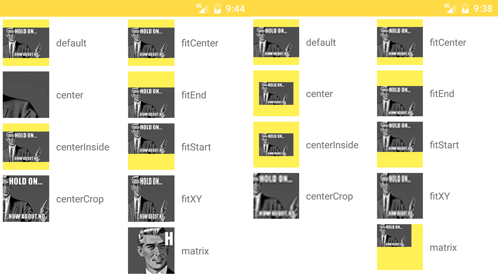

## 提出问题

当谈到 Android 中的 ImageView 时，我们总不能避免 ScaleType 这个属性，这个属性在图片资源和 View 尺寸不一样的时候经常用到，用于对图片资源进行自适应的展示。

所以，我们先来看看结果，看看 ScaleType 在多种情况下的实际表现。




上面这张图。黄色区域的部分是 ImageView 的控件大小，每一个 ImageView 的大小都是200 × 200，然后对于左边这组图片，src 的大小是720 × 470，对于右边这组图片，src的大小是 50 * 33（单位：像素）。

我们可以看出在八种不同的 ScaleType 的情况下，图片的变化情况。

接下来我们就从源码级别来探究为什么会出现这样的情况。


## 分析问题


本文源码基于Android API =25。

ScaleType 是 ImageView 的内部类，具有下面代码片中的八种状态，接下来我们就来逐一解释这八种状态。

```java

public enum ScaleType {

        /**
         * 绘制中缩放使用矩阵matrix来实现，设置矩阵可以使用这个方法
         * {@link ImageView#setImageMatrix(Matrix)}.
         */
        MATRIX      (0),
        FIT_XY      (1),
        FIT_START   (2),
        FIT_CENTER  (3),
        FIT_END     (4),
        /**
         * 图像在View的中心，但是不会执行缩放。
         */
        CENTER      (5),
        /**
         * 对图像进行均匀缩放（保持图像的长宽比），使图像的两个尺寸（宽度和高度）等于或大于 View 的相应尺寸（减去padding）。图像也是在View的中心。
         */
        CENTER_CROP (6),
        /**
         * 对图像进行均匀缩放（保持图像的长宽比），使图像的两个尺寸（宽度和高度）等于或小于 View 的相应尺寸（减去padding）。图像也是在View的中心。
         */
        CENTER_INSIDE (7);

        ...
    }

```

这八种状态可以分为三种情况来考虑，分别是：
- MATRIX
- FIT_XY, FIT_START, FIT_CENTER, FIT_END
- CENTER, CENTER_CROP, CENTER_INSIDE


为什么这么区分呢，我们先来看 ImageView 的 configBounds 方法。

```java
private void configureBounds() {
        if (mDrawable == null || !mHaveFrame) {
            return;
        }
        //默认值
        //mScaleType = ScaleType.FIT_CENTER;   

        //drawable尺寸，drawable为空是，dwidth，dheight为-1
        final int dwidth = mDrawableWidth;
        final int dheight = mDrawableHeight;

        final int vwidth = getWidth() - mPaddingLeft - mPaddingRight;
        final int vheight = getHeight() - mPaddingTop - mPaddingBottom;

        //当不存在drawable或者drawable刚好与view内容尺寸完全一样时，为适合尺寸
        final boolean fits = (dwidth < 0 || vwidth == dwidth)
                && (dheight < 0 || vheight == dheight);

        //如果没有drawable，或者为FIT_XY时，平铺
        if (dwidth <= 0 || dheight <= 0 || ScaleType.FIT_XY == mScaleType) {
            /* If the drawable has no intrinsic size, or we're told to
                scaletofit, then we just fill our entire view.
            */
            mDrawable.setBounds(0, 0, vwidth, vheight);
            mDrawMatrix = null;
        } else {
            // We need to do the scaling ourself, so have the drawable
            // use its native size.
            mDrawable.setBounds(0, 0, dwidth, dheight);

            if (ScaleType.MATRIX == mScaleType) {
                // Use the specified matrix as-is.
                if (mMatrix.isIdentity()) {//是否为单位矩阵
                    mDrawMatrix = null;
                } else {
                    mDrawMatrix = mMatrix;
                }
            } else if (fits) {
                // The bitmap fits exactly, no transform needed.
                mDrawMatrix = null;
            } else if (ScaleType.CENTER == mScaleType) {
                // Center bitmap in view, no scaling.
                mDrawMatrix = mMatrix;
                mDrawMatrix.setTranslate(Math.round((vwidth - dwidth) * 0.5f),
                                         Math.round((vheight - dheight) * 0.5f));
            } else if (ScaleType.CENTER_CROP == mScaleType) {
                mDrawMatrix = mMatrix;

                float scale;
                float dx = 0, dy = 0;

                if (dwidth * vheight > vwidth * dheight) {
                    scale = (float) vheight / (float) dheight;
                    dx = (vwidth - dwidth * scale) * 0.5f;
                } else {
                    scale = (float) vwidth / (float) dwidth;
                    dy = (vheight - dheight * scale) * 0.5f;
                }

                mDrawMatrix.setScale(scale, scale);
                mDrawMatrix.postTranslate(Math.round(dx), Math.round(dy));
            } else if (ScaleType.CENTER_INSIDE == mScaleType) {
                mDrawMatrix = mMatrix;
                float scale;
                float dx;
                float dy;

                if (dwidth <= vwidth && dheight <= vheight) {
                    scale = 1.0f;
                } else {
                    scale = Math.min((float) vwidth / (float) dwidth,
                            (float) vheight / (float) dheight);
                }

                dx = Math.round((vwidth - dwidth * scale) * 0.5f);
                dy = Math.round((vheight - dheight * scale) * 0.5f);

                mDrawMatrix.setScale(scale, scale);
                mDrawMatrix.postTranslate(dx, dy);
            } else {
                // Generate the required transform.
                mTempSrc.set(0, 0, dwidth, dheight);
                mTempDst.set(0, 0, vwidth, vheight);

                mDrawMatrix = mMatrix;
                mDrawMatrix.setRectToRect(mTempSrc, mTempDst, scaleTypeToScaleToFit(mScaleType));
            }
        }
    }
```

还有 initImageView 方法：
```java
private void initImageView() {
     mMatrix = new Matrix();
     mScaleType = ScaleType.FIT_CENTER;

     ···
 }
```

我们在 initImageView 方法里面有个重点就是 ImageView 对于 ScaleType 的默认值是 FIT_CENTER。

然后我们继续看 configBounds 方法，顾名思义，这个方法是用来配置 Drawable 的边界的，根据 ImageView 的 setBounds 方法来看，这个方法是可以给 drawable 设置一个矩形区域，使其只能在这个矩形区域内进行绘制。

接下来我们来看一下 configBounds 方法内部的实现。

最前面一段截至 if 判断的部分，声明了drawable尺寸 dwidth, dheight 和 View 的内容尺寸 vwidth, vheight。然后设定了一个布尔值的变量 fits, 顾名思义就是当这个值为真的时候，View 和 Drawable 正好完全贴合的。 这里的 dwidth 和 dheight, 当 Drawable 资源为空的时候，这两个的值为 -1 ，所以对于变量 fit ，当不存在 Drawable 或者 Drawable 刚好与 View 内容尺寸完全一样时， 这个值为 true 。

接下来有个 if 判断 ，当 资源的尺寸小于 0 时或者 ScaleType 为 FIT_XY 时，将 Drawable 绘制在这个(0, 0, vwidth, vheight)矩形区域里面，也就是 整个View 的视图，所以当我们回到那副图片，就不难发现为什么在 FIT_XY 情况下，不管图片大小如何，Drawable 都铺满了整个 View。

在这个 if 之后的 else ，则马上就已另一种参数调用了 setBounds 方法，将 Drawable 绘制在 (0, 0, dwidth, dheight) 区域里面，这个区域也就是 Drawable 本身的尺寸大小，所以并不会对 Drawable产生什么拉伸的变化，所以在联系上面 FIT_XY 的情况和那幅图片，这个时候就不难理解为什么只有 FIT_XY 情况下 Drawable 是被拉伸的尺寸了，因为除了这一种情况，其他情况都没有强制将 Drawable 绘制在某个区域内，而 FIT_XY 情况则不管 View 的尺寸是多大，强行将 Drawable 画在整个的 View 上面。

这个 else 里面有很多 if 分支，（第一个描述了 MATRIX 的情况，这个因为涉及到 Matrix 类，我们留在最后说，而且下面涉及到 Matrix 类的我们也先跳过）。再往下是 fits 为 true 的情况，这个也没什么可以说的，因为这个情况不是 Drawable 为空就是 Drawable 和 View 完全贴合，直接平铺上就去就好了，还设置个屁的边界啊，我们也跳过。

再往下就是 CENTER 系列的情况了，我们首先来看 CENTER，这个 if 分支里面的情况很简单，就两行代码,其中调用了 Matrix 类的 setTranslate 方法，这个方法的作用简单理解就是移动 Drawable 的位置的，两个参数分别是 x 轴和 y 轴的偏移量，值则是 View 和 Drawable 差值的一半。

```java
    mDrawMatrix = mMatrix;
    mDrawMatrix.setTranslate(Math.round((vwidth - dwidth) * 0.5f),
                             Math.round((vheight - dheight) * 0.5f));
```
经过这样位置的移动，不管是 Drawable 的尺寸大于或者小于 View的尺寸（即偏移量为负数或者正数），<font color="#ff6c67"><big>我们可以保证一点就是 Drawable 的中心点是与 View 的中心点重合，就是这两者都是相对于另一者，都是居中显示的。</big></font>除去偏移之外，没有其他任何对于 Drawable 的操作，所以我们在上面的图中看见的关于图片大于（小于） View 的情况,可以总结出 CENTER 的情况就是将图片居中于 View 显示，而且不做任何缩放。

接下来我们继续看下面一个 else if 的情况，CENTER_CROP。

```java
    mDrawMatrix = mMatrix;

    float scale;
    float dx = 0, dy = 0;

    if (dwidth * vheight > vwidth * dheight) {
        scale = (float) vheight / (float) dheight;
        dx = (vwidth - dwidth * scale) * 0.5f;
    } else {
        scale = (float) vwidth / (float) dwidth;
        dy = (vheight - dheight * scale) * 0.5f;
    }

    mDrawMatrix.setScale(scale, scale);
    mDrawMatrix.postTranslate(Math.round(dx), Math.round(dy));
```

对于 CENTER_CROP 这种情况，执行了 setScale（缩放） 和 postTranslate（平移）这两项操作，其中值得注意的是，translate 有个前缀 post，代表后乘，这一点与 pre, 前乘对应起来，表示 translate 在 scale 之后进行。我们来看具体的转化数值。

首先 if 里面其实就是  \frac{vwidth}{vheight}"> ,也就是比较 Drawable 和 View 的宽高比。

- 程序执行 if 内的代码的时机：当 Drawable 的宽高比大于 View 的宽高比时（此时 Drawable 在<font color="#ff6c67">水平方向</font>应该比 View 更加的<font color="#ff6c67">细长</font>），此时缩放比例是 `vheight / dheight`，这样一缩放，Drawable 和 View 在高度上就完美贴合了。然后修改偏移量，我们可以看到修改的的是 dx，也就是 x 轴的偏移量，`(vwidth - dwidth * scale) * 0.5f`刚好是转换后 Drawable 的宽度尺寸与 View 宽度尺寸差值的一半。对于一张 Drawable 比 View 在水平方向更加细长的一张图片，经过贴合高度的缩放和 x 轴的 平移，Drawable 和 View 的中心再次共用了一个点，使其图片符合居中的定义。

- 程序执行 else 内的代码的时机：当 Drawable 的宽高比小于 View 的宽高比时（此时 Drawable 在<font color="#ff6c67">垂直方向</font>应该比 View 更加的<font color="#ff6c67">细长</font>），此时缩放比例是 `vwidth / dwidth`，这样一缩放，Drawable 和 View 在宽度上就完美贴合了。然后修改偏移量，我们可以看到修改的的是 dy，也就是 y 轴的偏移量，`(vheight - dheight * scale) * 0.5f`刚好是转换后 Drawable 的高度尺寸与 View 高度尺寸差值的一半。对于一张 Drawable 比 View 在垂直方向更加细长的一张图片，经过贴合宽度的缩放和 y 轴的 平移，Drawable 和 View 的中心再次共用了一个点，使其图片符合居中的定义。

所以，对于 CENTER_CROP 的总结，就是<font color="#ff6c67">无论图片尺寸是大于 View 还是小于 View ，都会将其在于 View 的对比中，将 Drawable 和 View 高度比和宽度比其中较大的一个作为缩放比例，即，这样使得 Drawable 一定缩放至铺满整个 View，再经过水平方向或者垂直方向上的移动，使得 Drawable 的中心点和 View 的中心点重合。</font>

然后，接下来是 CENTER_INSIDE 的情况，我们来看代码：

```java
    if (dwidth <= vwidth && dheight <= vheight) {
        scale = 1.0f;
    } else {
        scale = Math.min((float) vwidth / (float) dwidth,
                (float) vheight / (float) dheight);
    }

    dx = Math.round((vwidth - dwidth * scale) * 0.5f);
    dy = Math.round((vheight - dheight * scale) * 0.5f);

    mDrawMatrix.setScale(scale, scale);
    mDrawMatrix.postTranslate(dx, dy);

```

可以看到其逻辑与 CENTER_CROP 的流程很相似，都是先行执行了缩放然后进行平移，只不过当 Drawable 的长宽都小于 View 时，缩放比为 1(不缩放),其他情况下则是执行了与 CENTER_CROP 完全相反的逻辑，,取了 Drawable 与 View 宽度比和高度比较小的那一个，这样的话，缩放结果使其刚好使 Drawable 数值较大的那一边与 View 完全贴合，同时计算偏移量使 Drawable 平移到 两者共中心，由于平移逻辑与上面类似，这里就不叙说平移的原理了。

所以对于 CENTER_INSIDE 的情况，则是当 Drawable 小于 View 时，将其平移到 View 的中心，其他情况下则是将其缩放至 Drawable 较大的边完全贴合 View 的相应尺寸。总的来说逻辑与 CENTER_CROP 相反。

接下来的逻辑，则是 FIT_XY, FIT_START, FIT_CENTER 一起处理的情况。我们直接看代码。

```java
    mTempSrc.set(0, 0, dwidth, dheight);
    mTempDst.set(0, 0, vwidth, vheight);

    mDrawMatrix = mMatrix;
    mDrawMatrix.setRectToRect(mTempSrc, mTempDst, scaleTypeToScaleToFit(mScaleType));
```
这里由于最终代码涉及到 JNI ，所以我们只讲结果，因为特么怎么做的过程我也不知道。。。。
我们只看最后一行，其中最后一个参数 Matrix.ScaleToFit
这个类又是一个枚举类，贴一下代码。

```java
    public enum ScaleToFit {
        /**
         * Scale in X and Y independently, so that src matches dst exactly. This may change the aspect ratio of the src.
         */
        FILL    (0),
        /**
         * Compute a scale that will maintain the original src aspect ratio, but will also ensure that src fits entirely inside dst. At least one axis (X or Y) will fit exactly. START aligns the result to the left and top edges of dst.
         */
        START   (1),
        /**
         * Compute a scale that will maintain the original src aspect ratio, but will also ensure that src fits entirely inside dst. At least one axis (X or Y) will fit exactly. The result is centered inside dst.
         */
        CENTER  (2),
        /**
         * Compute a scale that will maintain the original src aspect ratio, but will also ensure that src fits entirely inside dst. At least one axis (X or Y) will fit exactly. END aligns the result to the right and bottom edges of dst.
         */
        END     (3);

        // the native values must match those in SkMatrix.h
        ScaleToFit(int nativeInt) {
            this.nativeInt = nativeInt;
        }
        final int nativeInt;
    }

    private static Matrix.ScaleToFit scaleTypeToScaleToFit(ScaleType st)  {
        // ScaleToFit enum to their corresponding Matrix.ScaleToFit values
        return sS2FArray[st.nativeInt - 1];
    }
```

这里的英文我也不翻译了，大体上除了 FILL 之外的三种都是效果和 CENTER_INSIDE 是差不多的。只是 Drawable 和 View 的中心点略有不同。

其中：
- START 对应 FIT_START 模式将 Drawable 缩放成至少有一边与 View 相贴合，同时 Drawble 对齐以左上为基准。
- CENTER 对应 FIT_CENTER 模式将 Drawable 缩放成至少有一边与 View 相贴合，同时 Drawble 对齐以中心为基准（如果除去 Drawable 小于 View 的情况，此模式与 CENTER_INSIDE 完全相同）。
- END 对应 FIT_END 模式将 Drawable 缩放成至少有一边与 View 相贴合，同时 Drawble 对齐以右下为基准。

<font color="#666cff">同时，ScaleToFit 还有一种情况是 FILL，根据源码中的注释应该对应的是 FIT_XY ,但是在 configBounds 方法中的执行顺序，当ScaleType 为 FIT_XY 时，并不会执行到最后的 FIT 逻辑。所以此处存疑。</font>

最后还剩一种，ScaleType.MATRIX
这一种模式，和其他的七种都不太一样，所以放在最后。

首先，MATRIX 直译过来就是矩阵了，这个东西在线性代数里面被大量提到，在这里用来控制 ImageView 的 Drawable 的各种行为。
相应的 Matrix 类广泛用于 Bitmap 、Drawable 等类，用来处理图像，例如<font color="#ff6666">缩放，平移，错切，透视</font>等变换。
对于ImageView 也有一个 setImageMatrix 方法，用于 Matrix 类控制 Drawable 的行为。
这里推荐一篇博客，详细的介绍了MATRIX 的各种方法及原理。[android matrix 最全方法详解与进阶（完整篇）](http://blog.csdn.net/cquwentao/article/details/51445269)

所以这里也不详细探讨 Matrix 类的各种方法了，我们直接来看相关代码片。

```java
    if (mMatrix.isIdentity()) {//是否为单位矩阵
        mDrawMatrix = null;
    } else {
        mDrawMatrix = mMatrix;
    }
```

这里涉及到 Matrix 的一个方法需要讲解，Matrix#isIdentity，这个方法用来判断当前 Matrix 是否为单位矩阵，单位矩阵的意思相当于自然数里面的 1 ，相乘之后保持原状。
所以这里如果为单位矩阵的话，等于不需要 Matrix 来处理，所以直接将成员变量置为空了。 其他情况则执行相应的逻辑，在绘制阶段进行变换。

这里可能有一个疑问，既然 mMatrix 可以使用 setImageMatrix 来指定，那为什么还要设置一种 ScaleType 为 Matrix ，不为Matrix 的情况不是也可以变换么？
其实，如果在 Matrix 模式下不设置任何 Matrix 的情况下， Drawable 和 View 完全处于原始状态，属于平铺状态，如果是其他的 FIT 或者 CENTER 的话，configBounds 里面的变换会对 Matrix 造成一些影响，所以就单独设立了一个 MATRIX ,用来撇弃其他的变换，只让 Matrix 来进行变换吧。

最后再次贴上这张图，这篇博客就结束了。

