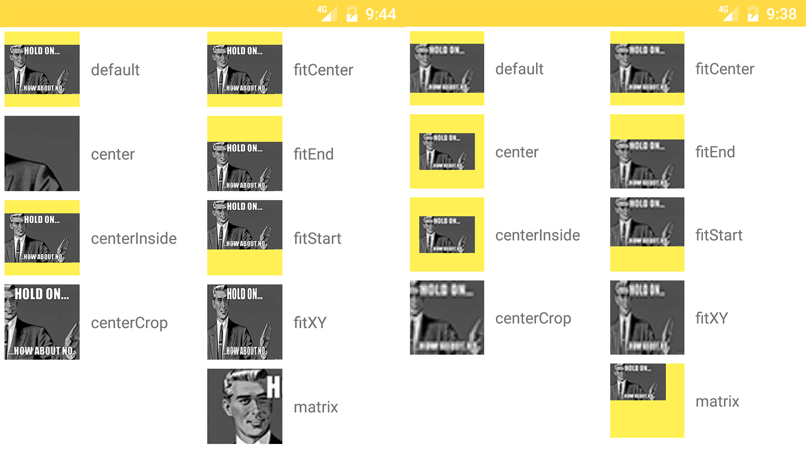

## 提出问题

当谈到 Android 中的 ImageView 时，我们总不能避免 ScaleType 这个属性，这个属性在图片资源和 View 尺寸不一样的时候经常用到，用于对图片资源进行自适应的展示。

所以，我们先来看看结果，看看 ScaleType 在多种情况下的实际表现。




上面这张图。黄色区域的部分是 ImageView 的控件大小，每一个 ImageView 的大小都是200 × 200，然后对于左边这组图片，src 的大小是720 × 470，对于右边这组图片，src的大小是 50 * 33（单位：像素）。

我们可以看出在八种不同的 ScaleType 的情况下，图片的变化情况。

接下来我们就从源码级别来探究为什么会出现这样的情况。


## 分析问题


本文源码基于Android API =25。

ScaleType 是 ImageView 的内部类，具有下面代码片中的八种状态，接下来我们就来逐一解释这八种状态。

```java

public enum ScaleType {

        /**
         * 绘制中缩放使用矩阵matrix来实现，设置矩阵可以使用这个方法
         * {@link ImageView#setImageMatrix(Matrix)}.
         */
        MATRIX      (0),
        FIT_XY      (1),
        FIT_START   (2),
        FIT_CENTER  (3),
        FIT_END     (4),
        /**
         * 图像在View的中心，但是不会执行缩放。
         */
        CENTER      (5),
        /**
         * 对图像进行均匀缩放（保持图像的长宽比），使图像的两个尺寸（宽度和高度）等于或大于 View 的相应尺寸（减去padding）。图像也是在View的中心。
         */
        CENTER_CROP (6),
        /**
         * 对图像进行均匀缩放（保持图像的长宽比），使图像的两个尺寸（宽度和高度）等于或小于 View 的相应尺寸（减去padding）。图像也是在View的中心。
         */
        CENTER_INSIDE (7);

        ...
    }

```

这八种状态可以分为三种情况来考虑，分别是：
- MATRIX
- FIT_XY, FIT_START, FIT_CENTER, FIT_END
- CENTER, CENTER_CROP, CENTER_INSIDE


为什么这么区分呢，我们先来看 ImageView 的 configBounds 方法。

```java
private void configureBounds() {
        if (mDrawable == null || !mHaveFrame) {
            return;
        }
        //默认值
        //mScaleType = ScaleType.FIT_CENTER;   

        //drawable尺寸，drawable为空是，dwidth，dheight为-1
        final int dwidth = mDrawableWidth;
        final int dheight = mDrawableHeight;

        final int vwidth = getWidth() - mPaddingLeft - mPaddingRight;
        final int vheight = getHeight() - mPaddingTop - mPaddingBottom;

        //当不存在drawable或者drawable刚好与view内容尺寸完全一样时，为适合尺寸
        final boolean fits = (dwidth < 0 || vwidth == dwidth)
                && (dheight < 0 || vheight == dheight);

        //如果没有drawable，或者为FIT_XY时，平铺
        if (dwidth <= 0 || dheight <= 0 || ScaleType.FIT_XY == mScaleType) {
            /* If the drawable has no intrinsic size, or we're told to
                scaletofit, then we just fill our entire view.
            */
            mDrawable.setBounds(0, 0, vwidth, vheight);
            mDrawMatrix = null;
        } else {
            // We need to do the scaling ourself, so have the drawable
            // use its native size.
            mDrawable.setBounds(0, 0, dwidth, dheight);

            if (ScaleType.MATRIX == mScaleType) {
                // Use the specified matrix as-is.
                if (mMatrix.isIdentity()) {//是否为单位矩阵
                    mDrawMatrix = null;
                } else {
                    mDrawMatrix = mMatrix;
                }
            } else if (fits) {
                // The bitmap fits exactly, no transform needed.
                mDrawMatrix = null;
            } else if (ScaleType.CENTER == mScaleType) {
                // Center bitmap in view, no scaling.
                mDrawMatrix = mMatrix;
                mDrawMatrix.setTranslate(Math.round((vwidth - dwidth) * 0.5f),
                                         Math.round((vheight - dheight) * 0.5f));
            } else if (ScaleType.CENTER_CROP == mScaleType) {
                mDrawMatrix = mMatrix;

                float scale;
                float dx = 0, dy = 0;

                if (dwidth * vheight > vwidth * dheight) {
                    scale = (float) vheight / (float) dheight;
                    dx = (vwidth - dwidth * scale) * 0.5f;
                } else {
                    scale = (float) vwidth / (float) dwidth;
                    dy = (vheight - dheight * scale) * 0.5f;
                }

                mDrawMatrix.setScale(scale, scale);
                mDrawMatrix.postTranslate(Math.round(dx), Math.round(dy));
            } else if (ScaleType.CENTER_INSIDE == mScaleType) {
                mDrawMatrix = mMatrix;
                float scale;
                float dx;
                float dy;

                if (dwidth <= vwidth && dheight <= vheight) {
                    scale = 1.0f;
                } else {
                    scale = Math.min((float) vwidth / (float) dwidth,
                            (float) vheight / (float) dheight);
                }

                dx = Math.round((vwidth - dwidth * scale) * 0.5f);
                dy = Math.round((vheight - dheight * scale) * 0.5f);

                mDrawMatrix.setScale(scale, scale);
                mDrawMatrix.postTranslate(dx, dy);
            } else {
                // Generate the required transform.
                mTempSrc.set(0, 0, dwidth, dheight);
                mTempDst.set(0, 0, vwidth, vheight);

                mDrawMatrix = mMatrix;
                mDrawMatrix.setRectToRect(mTempSrc, mTempDst, scaleTypeToScaleToFit(mScaleType));
            }
        }
    }
```

还有 initImageView 方法：
```java
private void initImageView() {
     mMatrix = new Matrix();
     mScaleType = ScaleType.FIT_CENTER;

     ···
 }
```

我们在 initImageView 方法里面有个重点就是 ImageView 对于 ScaleType 的默认值是 FIT_CENTER。

然后我们继续看 configBounds 方法，顾名思义，这个方法是用来配置 Drawable 的边界的，根据 ImageView 的 setBounds 方法来看，这个方法是可以给 drawable 设置一个矩形区域，使其只能在这个矩形区域内进行绘制。

接下来我们来看一下 configBounds 方法内部的实现。

最前面一段截至 if 判断的部分，声明了drawable尺寸 dwidth, dheight 和 View 的内容尺寸 vwidth, vheight。然后设定了一个布尔值的变量 fits, 顾名思义就是这个值为真的时候 View 和 Drawable 正好完全贴合。 这里的 dwidth 和 dheight, 当 Drawable 资源为空的时候，这两个的值为 -1 ，所以对于变量 fit ，当不存在 Drawable 或者 Drawable 刚好与 View 内容尺寸完全一样时， 这个值为 true 。

接下来有个 if 判断 ，当 资源的尺寸小于 0 时或者 ScaleType 为 FIT_XY 时，将 Drawable 绘制在这个(0, 0, vwidth, vheight)矩形区域里面，也就是 整个View 的视图，所以当我们回到那副图片，就不难发现为什么在 FIT_XY 情况下，不管图片大小如何，Drawable 都铺满了整个 View。

在这个 if 之后的 else ，则马上就已另一种参数调用了 setBounds 方法，将 Drawable 绘制在 (0, 0, dwidth, dheight) 区域里面，这个区域也就是 Drawable 本身的尺寸大小，所以并不会对 Drawable产生什么拉伸的变化，所以在联系上面 FIT_XY 的情况和那幅图片，这个时候就不难理解为什么只有 FIT_XY 情况下 Drawable 是被拉伸的尺寸了，因为除了这一种情况，其他情况都没有强制将 Drawable 绘制在某个区域内，而 FIT_XY 情况则不管 View 的尺寸是多大，强行将 Drawable 画在整个的 View 上面。

这个 else 里面有很多 if 分支，第一个描述了 MATRIX 的情况，我们留在最后说，先跳过。再往下是 fits 为 true 的情况，这个也没什么可以说的，因为这个情况不是 Drawable 为空就是 Drawable 和 View 完全贴合，直接平铺上就去就好了，还设置个屁的边界啊，我们也跳过。

再往下就是 CENTER 系列的情况了，我们首先来看 CENTER


ScaleType.MATRIX 这一种模式，和其他的七种都不太一样，
